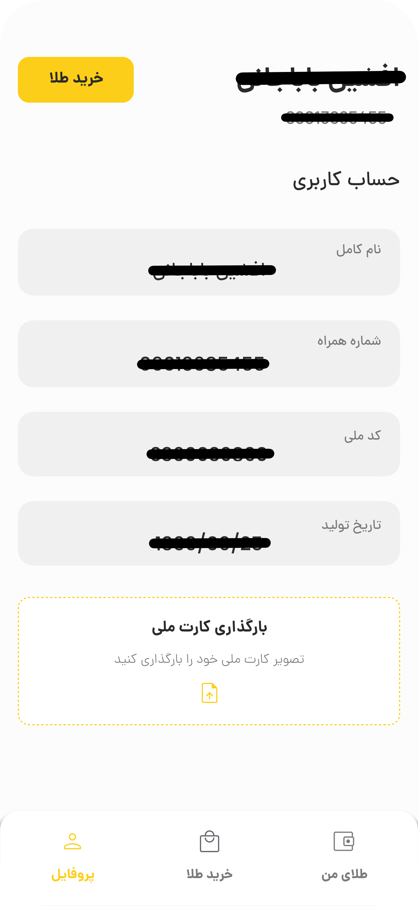

# 🛍️ Online Gold Store App (Flutter)

A cross-platform application designed for browsing, pricing, and purchasing gold products.  
Built with **Flutter**, the app features a clean UI and seamless user experience across platforms.

---

## ✨ Features

- Real-time gold price updates
- Product listings with images and details
- Shopping cart and secure checkout
- Cross-platform support: Android, iOS, Web, Windows

---

## 📸 Screenshots

  
  
  
  
  
  
  
  
  

---

## 🧰 Tech Stack

- Flutter (Dart)
- Provider (State Management)
- RESTful APIs
- Hive / SharedPreferences (Local Storage)

---

⚠️ **Note:** This repository is for showcasing the project only.  
The source code remains private.
